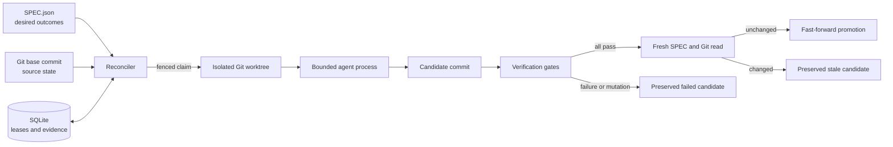

# Architecture

## Control flow

Accessible description: The reconciler compares the SPEC, Git commit, and
SQLite execution state. It sends a fenced claim to an isolated worktree. An
agent changes that worktree. Verification gates evaluate the change. The
controller commits the candidate and runs verification gates. The controller
rejects a gate that changes the candidate. It reads the SPEC and base Git commit
again. It promotes only an unchanged, verified, fast-forward candidate. It
preserves failed or stale candidates.

Diagram provenance: generated for `autobuild` from the repository lifecycle
contract on 2026-07-28. The Mermaid source in this file is the authoritative
visual source.

## Authority boundaries

| State | Authoritative owner | Worker authority |
|---|---|---|
| Desired outcomes | `SPEC.json` at the observed digest | Read only |
| Source revision | Git base repository | Changes only its worktree |
| Lease and event history | SQLite state database | Submits fenced events |
| Candidate content | Worktree branch | Can edit before evaluation |
| Promotion | Reconciler after fresh reads | None |

The controller uses an observation, comparison, action, and re-observation loop.
A process exit is execution evidence. It is not semantic success.

## Self-improvement

Self-improvement uses the normal work-item path. It does not bypass isolation,
tests, revalidation, or promotion rules. A self-improvement item must name a
measurable acceptance condition. The current milestone proves non-regression
with configured gates. Later milestones will add comparative metrics and
automatic experiment ranking.

## Recovery

The state database uses SQLite WAL mode. A controller restart reads current
leases and run states. An expired nonterminal run becomes stale, and its work
item becomes eligible for a new generation. Stale events cannot update the new
run. Failed and stale worktrees remain available until a later, explicit
cleanup policy has semantic evidence that they are disposable.

When automatic promotion is disabled, a verified candidate enters a stable
`awaiting-promotion` state. The work item becomes blocked, and lease expiry does
not discard the handoff evidence.

## Current limitations

- One controller must own a state database.
- The lease uses wall-clock time and does not provide a distributed consensus
  guarantee.
- The Codex adapter is the only live agent adapter.
- The harness does not renew leases during a long agent or gate process yet.
- Promotion does not create pull requests or push changes.
- The controller preserves worktrees but does not yet reconcile and clean
  terminal worktrees.
- Comparative self-improvement metrics are specified but not implemented.
