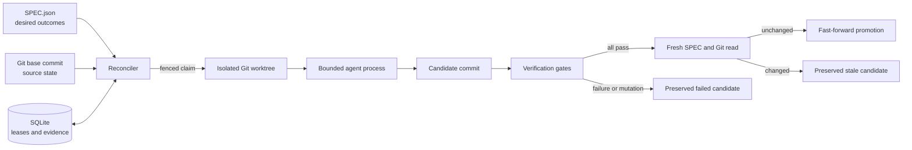

# Architecture

## Control flow

Accessible description: The reconciler compares the SPEC, Git commit, and
SQLite execution state. It sends a fenced claim to an isolated worktree. An
agent changes that worktree. Verification gates evaluate the change. The
controller commits the candidate and runs verification gates.

The controller
rejects a gate that changes the candidate. It reads the SPEC and base Git commit
again. It promotes only an unchanged, verified, fast-forward candidate. It
preserves failed or stale candidates.

Diagram provenance: generated for `autobuild` from the repository lifecycle
contract on 2026-07-28. The Mermaid source in this file is the authoritative
visual source.

## Authority boundaries

| State | Authoritative owner | Worker authority |
|---|---|---|
| Desired outcomes | `SPEC.json` at the observed full digest | Read only |
| Achieved item revision | Canonical work-item digest in SQLite | None |
| Source revision | Git base repository | Changes only its worktree |
| Lease and event history | SQLite state database | Submits fenced events |
| Candidate content | Worktree branch | Can edit before evaluation |
| Promotion | Reconciler after fresh reads | None |

The controller uses an observation, comparison, action, and re-observation loop.
A process exit is execution evidence. It is not semantic success.

The controller uses two specification digests. It hashes the exact
`SPEC.json` bytes to fence an active run. It also hashes the canonical JSON for
each work item. SQLite binds achieved state to the item digest. An unrelated
item or top-level edit does not reopen achieved work. A change to the achieved
item does reopen it.

The first sync after this identity model was introduced recognizes a legacy
achieved row only when its stored digest equals the current full specification
digest. It then stores the canonical item digest without reopening the item. A
simultaneous specification change causes conservative reopening.

The controller renews the current lease while an agent or gate process runs.
It stops the child process if renewal shows that the run lost authority. It
also renews the lease at controller boundaries before it records evidence,
commits a candidate, or changes execution state.

The process runner resolves each configured executable to an explicit path
before launch. This rule prevents Windows process creation from selecting a
different executable suffix than the interactive shell selects.

The controller gives verification gates a deterministic Python source path for
the candidate worktree. It disables ambient pytest plugin autoloading. A gate
must declare its required plugins through the project environment instead of
using unrelated globally installed plugins.

## Self-improvement

Self-improvement uses the normal work-item path. It does not bypass isolation,
tests, revalidation, or promotion rules. A self-improvement item must name a
measurable acceptance condition.

The controller runs all gates against the
base before dispatch. It records both the baseline and candidate gate vectors.
It records a per-gate pass delta for each observed candidate result. A failed
gate has a delta of `-1` when it passed at baseline and `0` when it also failed
at baseline. The controller classifies these outcomes as `regression` and
`no-improvement`, respectively.

A candidate that passes all gates records the total passing-gate-count delta.
A positive total is an `improvement`. A zero total is a `non-regression`.

## Recovery

The state database uses SQLite WAL mode. A controller restart reads current
leases and run states. An expired nonterminal run becomes stale, and its work
item becomes eligible for a new generation. Stale events cannot update the new
run. Failed and stale worktrees remain available until a later, explicit
cleanup policy has semantic evidence that they are disposable.

After a successful promotion, the controller can clean the successful
worktree. It first checks path containment, clean state, candidate identity,
commit reachability, and Git worktree registration. A failed cleanup preserves
the worktree and records terminal evidence.

When automatic promotion is disabled, a verified candidate enters a stable
`awaiting-promotion` state. The work item becomes blocked, and lease expiry does
not discard the handoff evidence.

## Current limitations

- One controller must own a state database.
- The lease uses wall-clock time and does not provide a distributed consensus
  guarantee.
- The Codex adapter is the only live agent adapter.
- Promotion does not create pull requests or push changes.
- The controller does not clean failed, stale, blocked, or manual-handoff
  worktrees.
- Self-improvement comparison is limited to gate pass deltas. The harness does
  not rank candidates with richer quality or performance metrics yet.
