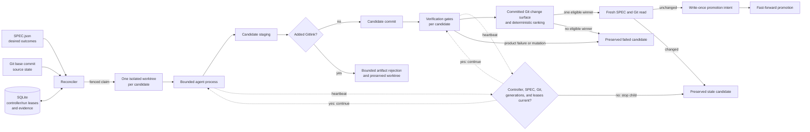

# Architecture

## Control flow

Accessible description: The reconciler compares the SPEC, Git commit, and
SQLite execution state. It sends a fenced claim to one isolated worktree for
product work. It sends a bounded self-improvement claim to a configured number
of isolated candidate worktrees. An agent changes each worktree. Verification
gates evaluate each committed change. The controller ranks self-improvement
candidates before it selects at most one candidate.

Before a candidate commit, the controller rejects each newly added Gitlink. A
rejected self-improvement candidate cannot run gates, receive a quality vector,
be eligible, or reach promotion. The controller preserves its worktree and
continues later isolated candidates.

The controller also rejects a gate that
changes a committed candidate. It reads the SPEC and base Git commit again. It
stores an immutable intent before it promotes an unchanged, verified,
fast-forward candidate. It preserves failed or stale candidates.

Diagram provenance: generated for `autobuild` from the repository lifecycle
contract on 2026-07-28. The Mermaid source in this file is the authoritative
visual source.

## Authority boundaries

| State | Authoritative owner | Worker authority |
|---|---|---|
| Controller ownership | SQLite owner token, repository identity, generation, and expiry | None |
| Desired outcomes | `SPEC.json` at the observed full digest | Read only |
| Achieved item revision | Canonical work-item digest in SQLite | None |
| Source revision | Git base repository | Changes only its worktree |
| Lease and event history | SQLite state database | Submits fenced events |
| Candidate content | Worktree branch | Can edit before evaluation |
| Promotion intent | Immutable SQLite row bound to the run and both SPEC identities | None |
| Promotion | Reconciler after fresh reads | None |

The controller uses an observation, comparison, action, and re-observation loop.
A process exit is execution evidence. It is not semantic success.

Before it synchronizes desired state or claims work, a controller acquires the
singleton ownership lease in the state database. The lease binds the state
database to the resolved base repository, owner token, generation, and expiry.
A second controller cannot acquire ownership while that lease is current.
Graceful completion expires the lease. A replacement controller can acquire a
higher generation after a crash lease expires.

The controller uses two specification digests. It hashes the exact
`SPEC.json` bytes to fence an active run. It also hashes the canonical JSON for
each work item. SQLite binds achieved state to the item digest. An unrelated
item or top-level edit does not reopen achieved work. A change to the achieved
item does reopen it.

The first sync after this identity model was introduced recognizes a legacy
achieved row only when its stored digest equals the current full specification
digest. It then stores the canonical item digest without reopening the item. A
simultaneous specification change causes conservative reopening.

Each agent and gate heartbeat first reads the full `SPEC.json` digest and base
Git commit. It then renews the controller ownership lease and validates the
stored run generation and lease time. A failed check stops the child and
prevents later state mutation. Source or run authority loss makes the run stale
and records an `authority_lost` event with one bounded cause. The bounded causes
are `spec-digest-changed`, `base-commit-changed`,
`lease-generation-changed`, `lease-expired`, and `run-not-active`.

The controller repeats the same authority revalidation at child completion and
at controller boundaries before it records evidence, commits a candidate,
starts evaluation, or promotes. Therefore, an authority loss during an agent
or gate process cannot produce later candidate evaluation or promotion.

Promotion starts only after the current controller lease passes validation.
Before Git changes the base, SQLite stores the run generation, expected base,
candidate commit, worktree, full SPEC digest, and canonical work-item digest.
Triggers reject changes to or deletion of that intent.
The controller holds an immediate SQLite transaction during the fast-forward
operation. This transaction prevents another controller from acquiring
ownership during the Git mutation.

The process runner resolves each configured executable to an explicit path
before launch. This rule prevents Windows process creation from selecting a
different executable suffix than the interactive shell selects.

The controller gives verification gates a deterministic Python source path for
the candidate worktree. It disables ambient pytest plugin autoloading. A gate
must declare its required plugins through the project environment instead of
using unrelated globally installed plugins.

## Self-improvement

Self-improvement uses the normal work-item path. It does not bypass isolation,
tests, revalidation, or promotion rules. A self-improvement item must name a
measurable acceptance condition.

The `[self_improvement]` configuration sets the maximum candidate count and the
combined agent-and-gate process-time budget for each candidate. The controller
creates each candidate from the claimed base commit in a separate Git worktree.
One candidate cannot change another candidate's source state.

The runtime adds hard ceilings to the configured values. One run can request
at most 8 candidates. One candidate can request at most 7200 seconds. The
candidate count multiplied by the per-candidate timeout cannot exceed 14400
seconds.

The controller runs all gates against the base before dispatch. It then runs
all configured gates for each candidate while its process-time budget remains.
An eligible candidate has a successful agent and all gates pass. No gate can
regress from the baseline. The gates must leave the committed candidate
unchanged.

Before it creates a candidate commit, the controller inspects newly staged
paths and rejects Gitlinks. This check keeps generated nested repositories out
of candidate history. It also prevents those repositories from making Git
treat the successful worktree as a worktree that contains submodules.

For self-improvement, this rejection has the bounded
`artifact-rejected` classification. SQLite records a rejected candidate with
null gate results, no candidate commit, no quality vector, and no eligibility.
SQLite rejects candidate states outside the bounded status and classification
vocabulary. After it stores an artifact rejection, it does not let that
candidate become a different disposition. The controller preserves that
worktree and continues the remaining isolated candidates. If all candidates
are rejected, the run records `no-eligible-candidate` and does not create
promotion intent.

After the gates, the controller measures each committed candidate against the
claimed base with Git `--numstat`. The quality vector contains changed files,
insertions, deletions, and changed lines. Changed lines equal insertions plus
deletions. Rename detection is disabled, so a rename is one deleted path and
one added path. A binary path contributes one changed file and zero changed
lines because Git does not provide binary line counts.

The controller orders eligible candidates before ineligible candidates. Within
each group, it orders candidates by fewer changed lines, fewer changed files,
and ascending candidate ID. A candidate without a committed quality vector
follows candidates that have vectors. The controller selects only the first
eligible candidate. If no candidate is eligible, the run fails without
promotion.

SQLite stores each candidate ID, ordinal, worktree, base commit, candidate
commit, gate vector, classification, gate-pass score, eligibility, rank, and
selection. A constrained quality table stores each committed change-surface
vector and requires nonnegative counts with changed lines equal to insertions
plus deletions. SQLite triggers reject later updates or deletion of a stored
quality vector. SQLite recomputes the permitted rank and winner before it
stores the promotion decision. A later awaiting or promoted decision must still
refer to the selected candidate, quality vector, and candidate commit. The
JSON status output includes these records.

Read-only status also supports a database created before the quality table
existed. It returns the preserved candidate and promotion rows with null
quality fields. It does not initialize or migrate the database.

## Recovery

The state database uses SQLite WAL mode. A controller restart cannot mutate
state while another controller lease is current. After expiry, the replacement
controller acquires a higher controller generation. It then reads current run
states and unresolved promotion intents before it creates a new claim.

Recovery compares the current full SPEC digest and canonical work-item digest
with the intent. It also compares the exact base commit with the expected base
and candidate commit. If the base equals the candidate, one SQLite transaction
marks the run successful, repairs item achievement, and repairs the selected
self-improvement promotion decision. If the base still equals the expected
base, recovery makes the old run stale and retryable. A divergent base or stale
SPEC authority makes the run stale without a Git operation. Repeated recovery
does not create another success event.

Recovery preserves the worktree.

An expired nonterminal run becomes stale, and its work item becomes
eligible for a new generation. Stale controller generations and stale run
events cannot update current state. Failed and stale worktrees remain available
until a later, explicit cleanup policy has semantic evidence that they are
disposable.

After a successful promotion, the controller can clean the successful
worktree. It first checks path containment, clean state, candidate identity,
commit reachability, and Git worktree registration. A failed cleanup preserves
the worktree and records terminal evidence.

For a ranked self-improvement run, automatic cleanup applies only to the
promoted winner. The controller preserves non-winning, rejected, and failed
candidate worktrees until a separate semantic cleanup decision exists.

When automatic promotion is disabled, a verified candidate enters a stable
`awaiting-promotion` state. The work item becomes blocked, and lease expiry does
not discard the handoff evidence.

## Current limitations

- Controller and run leases use wall-clock time and do not provide a
  distributed consensus guarantee.
- The Codex adapter is the only live agent adapter.
- Promotion does not create pull requests or push changes.
- The controller does not clean recovered, failed, stale, blocked, or
  manual-handoff worktrees.
- Self-improvement ranking uses Git file and line counts. It does not measure
  performance, maintainability, semantic value, or binary line size.
